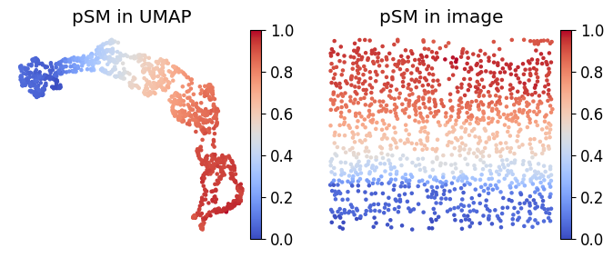

Cosmos - spatially resolved multi-omics data Integration
===================================

**Cosmos** is a Python library for Spatialmoics data Integration
offers a *simple* and *effective* tool.

Check out the :doc:`usage` section for further information, including
how to :ref:`installation` the project.

.. note::

   This project is under active development.

Contents
--------

.. toctree::
   :maxdepth: 1
   
   Installation
   Installation2
   cosmos_mouseVisualCortex_example

News
========
2022.03.05 Cosmostest based on PyTorch Geometric DGI framework is availble at .

