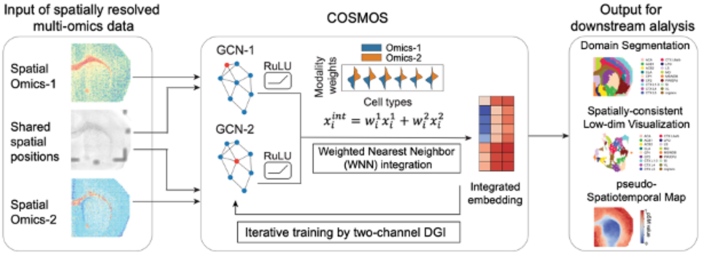

Cosmos - spatially resolved multi-omics data Integration
===================================

**Cosmos** is a Python library for Spatialmoics data Integration
offers a *simple* and *effective* tool.

.. note::

   This project is under active development.

Contents
--------

.. toctree::
   :maxdepth: 1
   
   Installation
   Cosmos_mouseVisualCortex_example

News
========

2024.10.08 Cosmos based on python version 3.8.8, pandas version 1.5.2, and so on.

Introduction
========

COSMOS is a computational tool crafted to overcome the challenges associated 
with integrating spatially resolved multi-omics data. This software harnesses a 
graph neural network algorithm to deliver cutting-edge solutions for analyzing 
biological data that encompasses various omics types within a spatial framework. 
Key features of COSMOS include domain segmentation, effective visualization, and 
the creation of spatiotemporal maps. These capabilities empower researchers to 
gain a deeper understanding of the spatial and temporal dynamics within 
biological samples, distinguishing COSMOS from other tools that may only support 
single omics types or lack comprehensive spatial integration. The proven 
superior performance of COSMOS underscores its value as an essential resource in 
the realm of spatial omics.

Citation
========

Cooperative Integration of Spatially Resolved Multi-Omics Data with 
COSMOS, Zhou Y., X. Xiao, L. Dong, C. Tang, G. Xiao*, and L Xu*, 2024. 
